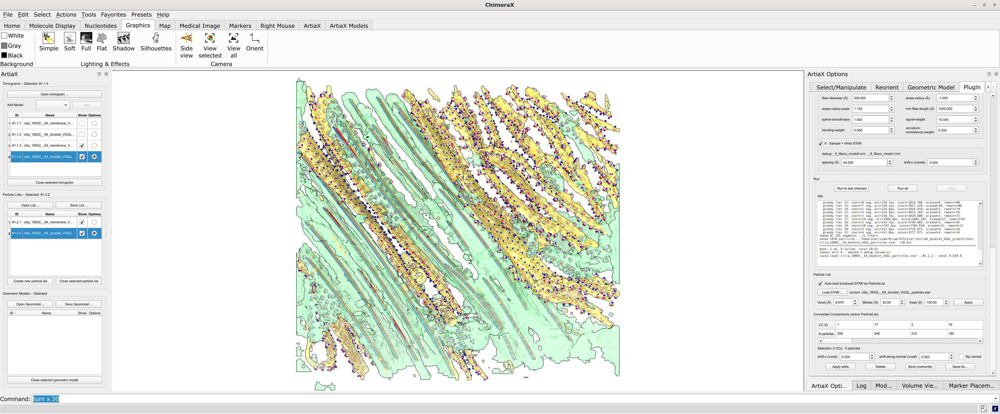

# ArtiaX


ArtiaX is an open-source extension of the molecular visualisation program ChimeraX and is primarily intended for 
visualization and processing of cryo electron tomography data. It allows easy import and export of particle lists in 
various formats and performant interaction with the data on screen and in virtual reality.

Features include:
* Particle Picking
* Particle orientation on screen and in VR
* Isosurface visualization at particle locations
* Interactive particle sub-setting based on metadata
* Rendering particles using metadata-based colormaps

Read the companion paper on [bioRxiv](https://www.biorxiv.org/content/10.1101/2022.07.26.501574v1).

## AIS2star plugin

This fork ships a **Plugin** tab inside ArtiaX Options that drives the AIS2star
`fiber2star` / `mem2star` pipelines in a user-selected conda env (CUDA via
cupy / cucim), auto-opens each step's debug MRC, and loads the final STAR as
a ParticleList with per-connected-component select / edit / save. Suitable
for filament and membrane segmentation from cryo-ET tomograms. Developers
looking to extend it should read [PLUGIN_PLAN.md](PLUGIN_PLAN.md) for the
architecture, step schemas, and Qt traps.

<p align="center">
  
</p>

### Install the plugin

Requires ChimeraX ≥ 1.3 and an NVIDIA GPU with the CUDA 13 driver (≥ 580.x)
available on the host.

**1 — Install the ArtiaX2star bundle into ChimeraX.** `devel install`
symlinks the source, so further edits need only a ChimeraX restart:
```bash
git clone https://github.com/huwl404/ArtiaX2star.git
chimerax --cmd "devel install /path/to/ArtiaX2star ; exit"
```

**2 — Create the GPU conda env the Plugin tab will call.** The heavy
`cupy` / `cucim` work runs in a separate env (kept out of ChimeraX's Python
to avoid CUDA / ABI conflicts). Pinned versions live in
[`src/plugin/ais2star/requirements.txt`](src/plugin/ais2star/requirements.txt):
```bash
conda create -n ais2star python=3.12 -y
conda activate ais2star
pip install -r src/plugin/ais2star/requirements.txt
```
Point the Plugin tab's **Environment** picker at this env's
`python` (e.g. `~/miniconda3/envs/ais2star/bin/python`) and click **Test env**
— it probes for CUDA, cupy, cucim, mrcfile, and starfile.

# Install ArtiaX

## Using the ChimeraX toolshed

1. Download the latest Version of ChimeraX (version >= 1.3) to your operating system from here: 
[ChimeraX Download](https://www.rbvi.ucsf.edu/chimerax/download.html#release). 

2. Run these commands in the ChimeraX shell:
>toolshed reload all

>toolshed install ArtiaX

3. Relaunch ChimeraX

## Using the wheel file

1. Download the latest Version of ChimeraX (version >= 1.3) to your operating system from here: 
[ChimeraX Download](https://www.rbvi.ucsf.edu/chimerax/download.html#release). 

2. Download the latest [release](https://github.com/FrangakisLab/ArtiaX/releases/tag/v0.1).

3. Open ChimeraX and install the package using the command:
>toolshed install ChimeraX_ArtiaX-VERSION-py3-none-any.whl

4. Relaunch ChimeraX.

# References 

* ChimeraX:

  * UCSF ChimeraX: Structure visualization for researchers, educators, and developers. Pettersen EF, Goddard TD, Huang CC, Meng EC, Couch GS, Croll TI, Morris JH, Ferrin TE. Protein Sci. 2021 Jan;30(1):70-82.  

  * UCSF ChimeraX: Meeting modern challenges in visualization and analysis. Goddard TD, Huang CC, Meng EC, Pettersen EF, Couch GS, Morris JH, Ferrin TE. Protein Sci. 2018 Jan;27(1):14-25.
  
* Mycoplasma genitalium cell (left banner, rendered using ArtiaX)

  * Structural characterization of the NAP; the major adhesion complex of the human pathogen Mycoplasma genitalium. Scheffer MP, Gonzalez-Gonzalez L, Seybert A, Ratera M, Kunz M, Valpuesta JM, Fita I, Querol E, Piñol J, Martín-Benito J, Frangakis AS. Molecular Microbiology 2017, 105(6), 869–879.

* HIV capsid locations (right banner, rendered using ArtiaX) 

  * A Bayesian approach to single-particle electron cryo-tomography in RELION-4.0. Zivanov J, Otón J, Ke Z, Qu K, Morado D, Castaño-Díez D, Kügelgen A Bharat TAM, Briggs JAG, Scheres SHW. BioRxiv 2022, 2022.02.28.482229. https://doi.org/10.1101/2022.02.28.482229
  
  * An atomic model of HIV-1 capsid-SP1 reveals structures regulating assembly and maturation. Schur FKM, Obr M, Hagen WJH, Wan W, Jakobi AJ, Kirkpatrick JM, Sachse C, Kräusslich HG, Briggs, JAG. Science 2016, 353(6298), 506–508.
